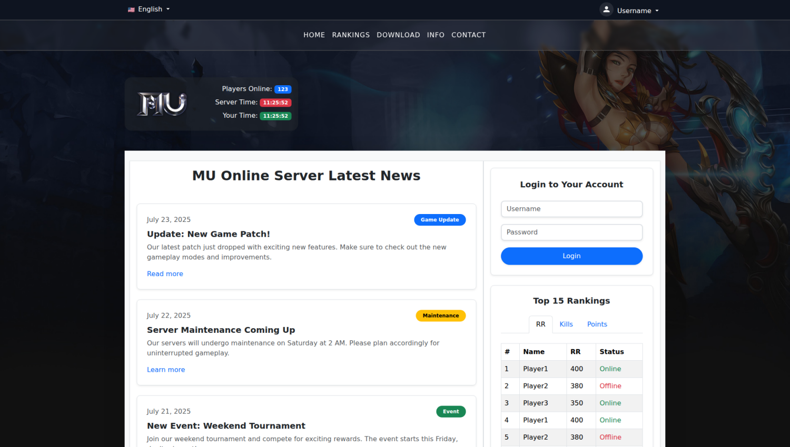
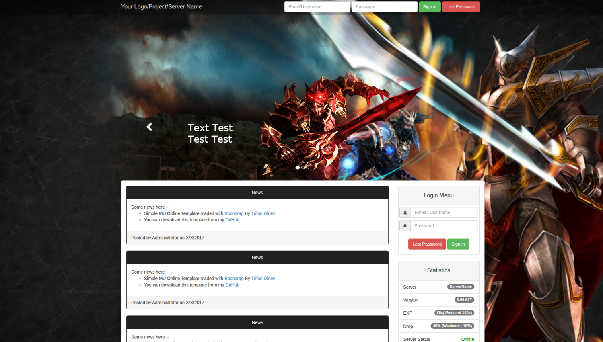
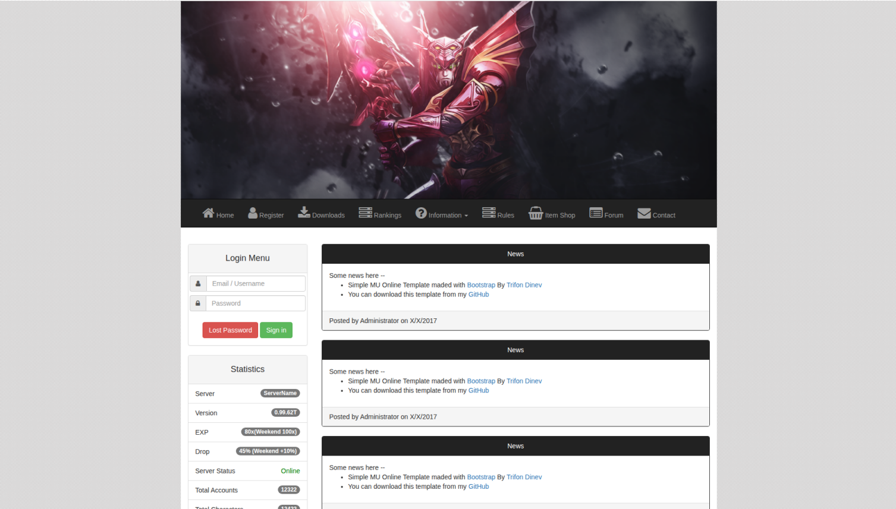
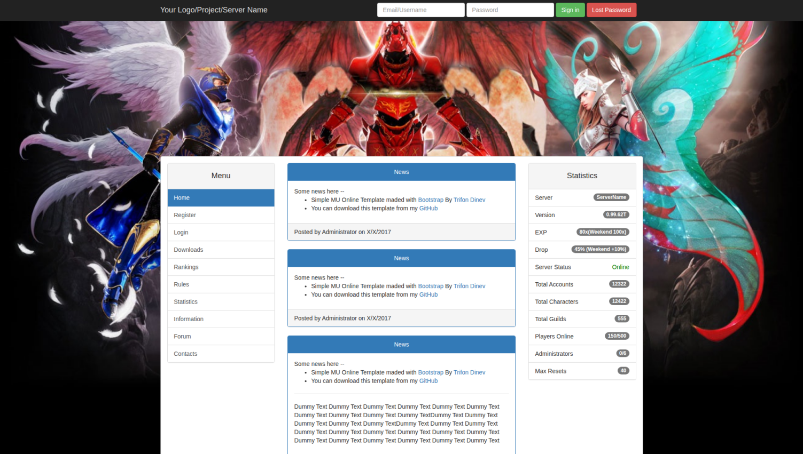
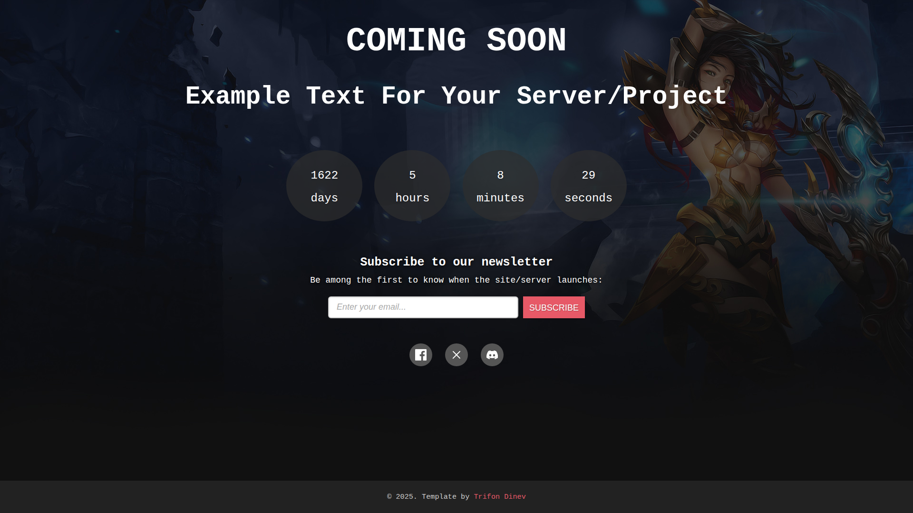

# Simple MU Online Templates
Some simple MU Online HTML5/CSS3 templates that are quite old and nothing special.

  
  
  
  
  

## Features:
- Responsive templates based on Bootstrap 3.3.7, Bootstrap 5.3.7
- Each template has valid HTML5 and CSS3 (custom.css)

## License:
Licensed under the [MIT License](LICENSE).